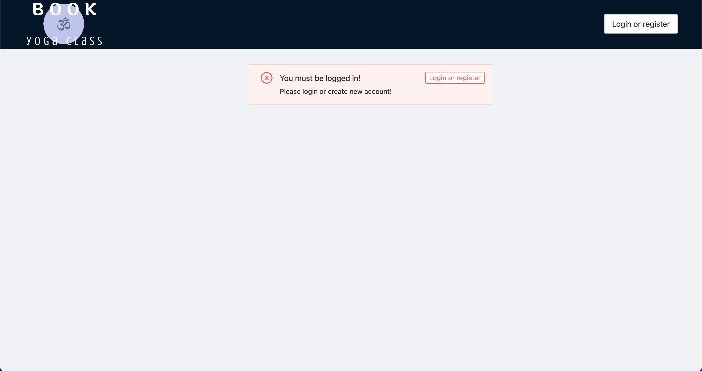

# Book yoga class app 📅🧘‍♀️

An app for booking and adding yoga class created with ReactJS, Redux-toolkit and Ant-design.

## Installation

Install book-yoga-class with npm

```bash
  npm install book-yoga-class
  cd book-yoga-class
```

Install json-server

```bash
  npm install -g json-server
```

Run the server

```bash
  json-server db.json -m ./node_modules/json-server-auth --port 4000
```

Run the app in another terminal

```bash
  npm run start
```

## Tech Stack

**Client:**

- [React](https://reactjs.org/)
- [Redux Toolkit](https://redux-toolkit.js.org/)
- [Ant Design](https://ant.design/)

**Server:**

- [json-server](https://github.com/typicode/json-server)
- [json-server-auth](https://github.com/jeremyben/json-server-auth)

## Features

- Login and registration with authentication
- User - student mode:
  - booking yoga class
  - cancelling booked class
  - displays all booked classes
- User - teacher mode:
  - adding new class
  - cancelling class
  - displays classes and list of students

## Screenshots

*Login*


*Registration*


*User login ➡️ Calendar view ➡️ booking class*


*Calendar with classes*


*Book and cancel booking*


*Booked classes*


*User can't book class if there is no free spot (button is disable)*


*Add new class by teacher*


*Classes with students list*


*User must be looged in to see calendar*

